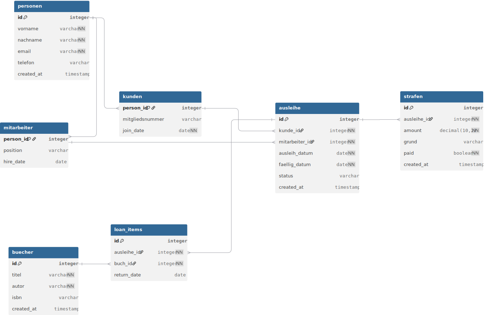

# Datenbank – Bibliothek

## DBdiagram (Read-only)
https://dbdiagram.io/d/Bibliothek-6965f6acd6e030a024de05e4

## Dateien
- `db/schema.dbml` – DBML-Schema (Quelle: dbdiagram.io)
- `db/schema.sql` – SQL-Export
- `docs/erd.svg` – ER-Diagramm-Export

## Kurzbeschreibung
Modell eines Bibliothekssystems mit den wichtigsten Entitäten:
- `personen` (Basisdaten)
- `kunden` und `mitarbeiter` als 1:1-Erweiterungen von `personen`
- `buecher` (Bücher)
- `ausleihe` (Ausleihen) + `loan_items` (Ausleihpositionen)
- `strafen` (Strafen im Zusammenhang mit Ausleihen)

# Datenbank – Bibliothek

Dieses Repository enthält das Datenbankmodell (DBML) für ein Bibliothekssystem, erstellt mit dbdiagram.io.

## DBdiagram (Read-only Link)
https://dbdiagram.io/d/Bibliothek-6965f6acd6e030a024de05e4

## Inhalt
- `db/schema.dbml` – DBML-Definition des Schemas (Quelle: dbdiagram.io)
- `db/schema.sql` – SQL-Export des Schemas
- `docs/erd.svg` – Export des ER-Diagramms (SVG)
- (optional) `docs/Bibliothek.pdf` – PDF-Export des Diagramms

## Kurzbeschreibung des Modells

### personen
Basistabelle mit Personendaten.
- Primärschlüssel: `id`
- Attribute: `vorname`, `nachname`, `email` (unique), `telefon`, `created_at`

### kunden (1:1-Erweiterung von personen)
Ein Kunde ist eine Person mit zusätzlichen Kundendaten.
- Primärschlüssel & Fremdschlüssel: `person_id` → `personen.id`
- Attribute: `mitgliedsnummer` (unique), `join_date`

**Beziehung:** `personen` 1 — 1 `kunden`

### mitarbeiter (1:1-Erweiterung von personen)
Ein Mitarbeiter ist eine Person mit zusätzlichen Mitarbeiterdaten.
- Primärschlüssel & Fremdschlüssel: `person_id` → `personen.id`
- Attribute: `position`, `hire_date`

**Beziehung:** `personen` 1 — 1 `mitarbeiter`

### buecher
Tabelle für Buch-Metadaten.
- Primärschlüssel: `id`
- Attribute: `titel`, `autor`, `isbn`, `created_at`

### ausleihe
Zentrale Entität für Ausleihvorgänge.
- Primärschlüssel: `id`
- Fremdschlüssel: `kunde_id` → `kunden.person_id`, `mitarbeiter_id` → `mitarbeiter.person_id`
- Attribute: `ausleih_datum`, `faellig_datum`, `status`, `created_at`

**Beziehungen:**
- `kunden` 1 — N `ausleihe`
- `mitarbeiter` 1 — N `ausleihe`

### loan_items
Positionen einer Ausleihe (welche Bücher ausgeliehen wurden).
- Primärschlüssel: `id`
- Fremdschlüssel: `ausleihe_id` → `ausleihe.id`, `buch_id` → `buecher.id`
- Attribute: `return_date`

**Beziehungen:**
- `ausleihe` 1 — N `loan_items`
- `buecher` 1 — N `loan_items`

Damit wird eine N:M-Beziehung zwischen `ausleihe` und `buecher` über `loan_items` modelliert.

### strafen
Strafen (z.B. bei Verspätung) im Zusammenhang mit einer Ausleihe.
- Primärschlüssel: `id`
- Fremdschlüssel: `ausleihe_id` → `ausleihe.id`
- Attribute: `amount`, `grund`, `paid`, `created_at`

**Beziehung:** `ausleihe` 1 — N `strafen` (falls mehrere Strafen pro Ausleihe erlaubt sind)

## Diagramm

